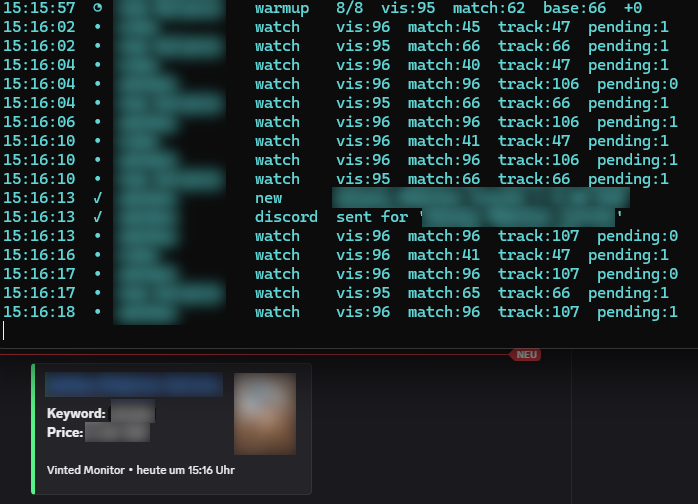

# Vinted Monitor

A multithreaded Vinted monitor with Discord webhook alerts, which constantly monitors for items (via keywords) - and notifies you when new items with the defined parameters (keyword + min price + max price) has been found.



## Features

- multiple keywords (and therefore multiple monitors in parallel)
- optional per-keyword `min_price` and `max_price`
- Discord webhook notifications for newly detected matching items
- warmup phase on startup to reduce false positives
- repeated-seen confirmation before sending alerts

## Setup

### 1. Install dependencies

Install Python 3.9+, and then use the following command:

```bash
pip install -r requirements.txt
```

### 2. Create your local config

Rename the file `settings.example.json` to settings.json - or use the following commands:

```bash
cp settings.example.json settings.json
```

Windows PowerShell:

```powershell
Copy-Item settings.example.json settings.json
```

### 3. Edit `settings.json`

Adjust by your desired keywords, optional price ranges, Discord webhook URLs, and delay settings.

### 4. Run the monitor

```bash
python main.py
```

## Configuration

Example:

```json
{
  "sleep": 3.0,
  "timeout": 15,
  "per_page": 96,
  "warmup_cycles": 8,
  "confirm_seen_count": 2,
  "status_every": 5,
  "retries_total": 2,
  "backoff_factor": 0.5,

  "log_file": "vinted_monitor.log",
  "log_level": "INFO",

  "discord_username": "Vinted Monitor",
  "discord_avatar_url": "",
  "discord_webhooks": [
    "https://discord.com/api/webhooks/XXX/YYY"
  ],

  "headers": {
    "accept": "text/html,application/xhtml+xml,application/xml;q=0.9,image/avif,image/webp,image/apng,*/*;q=0.8,application/signed-exchange;v=b3;q=0.7",
    "accept-language": "de-DE,de;q=0.9",
    "priority": "u=0, i",
    "sec-ch-ua": "\"Google Chrome\";v=\"129\", \"Not=A?Brand\";v=\"8\", \"Chromium\";v=\"129\"",
    "sec-ch-ua-mobile": "?1",
    "sec-ch-ua-platform": "\"Android\"",
    "sec-fetch-dest": "document",
    "sec-fetch-mode": "navigate",
    "sec-fetch-site": "none",
    "sec-fetch-user": "?1",
    "upgrade-insecure-requests": "1",
    "user-agent": "Mozilla/5.0 (iPhone; CPU iPhone OS 16_6 like Mac OS X) AppleWebKit/605.1.15 (KHTML, like Gecko) Version/16.6 Mobile/15E148 Safari/604.1"
  },

  "keywords": [
    { "keyword": "adidas" },
    { "keyword": "nike", "min_price": 10 },
    { "keyword": "new balance", "min_price": 20, "max_price": 80 }
  ]
}
```

## Keyword Price Filters

Each keyword entry can define optional limits:

- `min_price`: only match items priced greater than or equal to this value
- `max_price`: only match items priced less than or equal to this value

Examples:

```json
{ "keyword": "nike" }
{ "keyword": "nike", "min_price": 15 }
{ "keyword": "nike", "max_price": 40 }
{ "keyword": "nike", "min_price": 15, "max_price": 40 }
```

If no price filter is set, all prices are accepted.

## Important Settings

### `sleep`

Delay between polling cycles per keyword thread.

### `warmup_cycles`

Number of startup cycles where items are collected into the baseline without sending alerts.

### `confirm_seen_count`

How many times a newly seen matching item must appear before it is treated as real and sent to Discord.

### `status_every`

How often normal status lines are shown in the console.

Higher value = less console spam.

## Disclaimer

This tool is intended for personal use only. Use it responsibly. Vinted may rate limit, block, or change behavior at any time.
The author is not responsible for any mis-use of this software.
